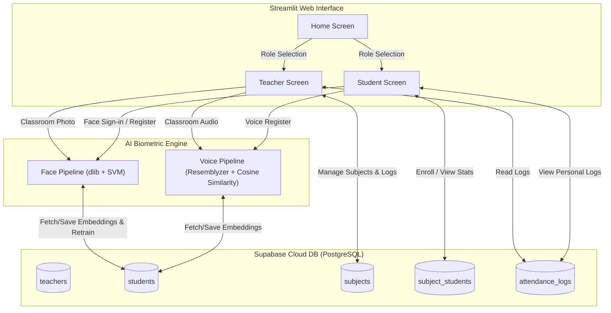

# SnapClass 📸🎙️
> **AI-Powered Multimodal Attendance System using Face ID and Voice Verification**

SnapClass is a modern, zero-friction classroom management web application that replaces traditional roll calls with state-of-the-art biometrics. Using deep-learning-based **Face Recognition (128D)** and **Voice Verification (256D)**, it allows teachers to take attendance in seconds while providing students with a seamless, passwordless login experience.

---

## 🏗️ System Architecture

The application is built using a decoupled, modular design divided into three key layers: **Front-end UI**, **AI Processing Pipelines**, and a **Real-Time Backend Database**.



---

## 🧠 Core Machine Learning Pipelines

This system features two high-performance pipelines for processing visual and auditory biometrics. Understanding these pipelines is crucial for ML/AI engineering interviews.

### 1. Face Recognition Pipeline (`face_pipeline.py`)

The Face Recognition system uses a hybrid approach: **Deep Feature Extraction** combined with a **Support Vector Machine (SVM) Classifier** and **Euclidean Distance Verification** for fraud prevention.

```
[Input Image] 
      │
      ▼
[dlib Frontal Face Detector] ──(Detects bounding boxes)
      │
      ▼
[dlib 68-Point Landmark Predictor] ──(Aligns face shape)
      │
      ▼
[dlib ResNet Face Encoder] ──(Computes 128D normalized embedding vector)
      │
      ▼
[Linear SVM Classifier] ──(Predicts the most probable Student ID)
      │
      ▼
[L2 Norm Distance Check] ──(Verifies if Euclidean distance <= 0.6)
      │
      ├─► Yes ──► [Present / Logged In]
      └─► No  ──► [Out-of-Universe / Unknown Face]
```

*   **Face Detection & Alignment:**
    *   **Detector:** Uses `dlib.get_frontal_face_detector()`, which is a Histogram of Oriented Gradients (HOG) combined with a Linear Support Vector Machine (SVM) sliding-window detector.
    *   **Landmarks:** `shape_predictor` identifies $68$ key points on the face (eyes, nose, mouth, jawline) to align the face crop, ensuring pose invariance.
*   **Feature Extraction:**
    *   The aligned face crop is passed through a pre-trained deep ResNet model (`dlib.face_recognition_model_v1`) to generate a **$128$-dimensional embedding vector**. The network is trained so that embeddings of the same person are close together, and embeddings of different people are far apart.
*   **Classification & Out-of-Universe Verification:**
    *   **SVM Classifier:** A Support Vector Classifier (SVC) with a **linear kernel** is trained dynamically on the embeddings of registered students.
    *   **L2 Distance Verification:** Because an SVM will *always* assign a test face to one of the trained classes (even if the face belongs to a complete stranger), we implement a verification layer. We calculate the Euclidean distance ($L_2$ norm) between the detected embedding ($e$) and the stored training embedding ($s$) of the predicted student:
        $$\text{Distance} = \| e - s \|_2$$
    *   If the distance is less than or equal to the threshold of **$0.6$**, the prediction is verified. If it is greater than $0.6$, the face is flagged as unrecognized (i.e., a stranger or proxy attempt).

---

### 2. Voice Verification Pipeline (`voice_pipeline.py`)

The voice pipeline allows students to mark attendance by speaking a phrase. It can process a **single voice enrollment** or analyze **bulk classroom audio** (e.g., roll call recordings).

```
[Bulk Audio Recording]
         │
         ▼
[librosa.effects.split (30dB threshold)] ──(Splits audio into speech segments)
         │
         ▼
[Filter short segments (<0.5s)] ──(Removes noise/mouth clicks)
         │
         ▼
[Resemblyzer VoiceEncoder] ──(Extracts 256D d-vector embedding per segment)
         │
         ▼
[Cosine Similarity Check] ──(Dot product comparison against candidate embeddings)
         │
         ├─► Max Similarity >= 0.65 ──► [Recognized Student ID]
         └─► Max Similarity < 0.65  ──► [Unrecognized Voice]
```

*   **Audio Preprocessing & Segmentation:**
    *   Audio is loaded at a sample rate of $16,000\text{ Hz}$ using `librosa.load`.
    *   For bulk recordings, `librosa.effects.split(audio, top_db=30)` splits the continuous audio stream into segments of active speech by analyzing amplitude thresholding ($30\text{ dB}$ below reference).
    *   Segments shorter than $0.5\text{ seconds}$ are automatically ignored to filter out clicks, breath sounds, or background noise.
*   **Speaker Embedding (D-Vector):**
    *   Each active audio segment is preprocessed (`preprocess_wav`) and sent to `resemblyzer.VoiceEncoder` (a deep neural network trained using Generalized End-to-End loss for speaker verification).
    *   It outputs a **$256$-dimensional embedding** (d-vector) representing the speaker's vocal characteristics.
*   **Speaker Matching (Cosine Similarity):**
    *   Since the speaker embeddings are unit-normalized ($L_2$ norm $= 1$), the cosine similarity between the new segment embedding ($v_{\text{new}}$) and a stored candidate embedding ($v_{\text{db}}$) is equivalent to their **dot product**:
        $$\text{Cosine Similarity} = v_{\text{new}} \cdot v_{\text{db}}$$
    *   The segment is identified as belonging to the student with the highest similarity score, provided it meets the verification threshold of **$0.65$**.

---

## 🗄️ Database Schema (Supabase PostgreSQL)

The system integrates with Supabase, utilizing PostgreSQL tables to manage relational data and store high-dimensional embeddings as numeric arrays.

| Table Name | Primary Key | Attributes / Columns | Description |
| :--- | :--- | :--- | :--- |
| **`teachers`** | `teacher_id` | `username` (unique), `password` (bcrypt), `name` | Teacher accounts for managing subjects. |
| **`students`** | `student_id` | `name`, `face_embedding` (`float8[]`), `voice_embedding` (`float8[]`) | Student biometric profiles and identity. |
| **`subjects`** | `subject_id` | `subject_code` (unique), `name`, `section`, `teacher_id` (FK) | Academic courses created by teachers. |
| **`subject_students`**| `id` (or composite)| `student_id` (FK), `subject_id` (FK) | Join table mapping student enrollment. |
| **`attendance_logs`** | `log_id` | `student_id` (FK), `subject_id` (FK), `timestamp`, `is_present` | Individual attendance records. |

---

## 🎨 UI Styling & User Experience

Built on Streamlit, SnapClass features a polished, premium aesthetic that bypasses default styling using custom CSS overrides in [base_layout.py](file:///Users/himanshugupta/Desktop/Prime/AI_Attendence_System/src/ui/base_layout.py):

*   **Custom Typography:** Loads and applies Google Fonts: `'Climate Crisis'` (for headings and titles) and `'Outfit'` (for UI body text).
*   **Dynamic Design & Hover Effects:** Interactive buttons have smooth scale-up micro-animations (`transform: scale(1.05)`) on hover, creating an immersive web app feel.
*   **Harmonious Color Palette:** Uses dark-themed backgrounds (`#E0E3FF`, `#5865F2` for Discord Indigo, and `#EB459E` for hot pink) rather than default generic colors.

---

## 🎯 Interview Q&A Cheat Sheet (Perfect for Prep)

Be ready to answer these questions during an interview. They cover system design, edge cases, machine learning details, and database tuning.

### Q1: Why did you train a classification model (SVM) instead of just comparing Euclidean distances for Face ID?
> **Answer:** 
> When the classroom sizes grow, calculating the distance between a newly detected face and every single student in the database (k-NN or pairwise comparison) becomes a $O(N)$ operation. 
> Training a Linear Support Vector Machine (SVM) on the database allows us to compute optimal decision boundaries. This is much faster during inference because evaluating the SVM decision function is highly optimized. 
> However, SVMs have a major flaw: they are "closed-universe" models. If you show it a stranger's face, it will still assign it to the closest student boundary. To fix this, we combine them: we use the SVM for a fast prediction, then verify the decision by checking the Euclidean distance between the input and that specific student's template. If the distance exceeds $0.6$, we reject it.

### Q2: What is the math behind Speaker Verification using Resemblyzer?
> **Answer:**
> Resemblyzer utilizes a neural network trained on speaker verification tasks to extract a "d-vector" (speaker embedding) of size $256$. This embedding captures speaker identity features (timbre, pitch, vocal tract shape) while being invariant to text spoken and background noise.
> Because the output d-vectors are unit-normalized ($L_2$ norm of $1.0$), the cosine similarity is simplified to a dot product. The dot product yields a value between $-1.0$ and $+1.0$. A threshold of $0.65$ ensures that only voices matching closely with the enrolled student's vocal profile are accepted, reducing false positives caused by environmental noises.

### Q3: How does the "Voice Roll Call" segment bulk audio files, and what challenges does it face?
> **Answer:**
> The bulk audio pipeline uses `librosa.effects.split` to segment continuous audio. It identifies silence periods based on a threshold ($30\text{ dB}$ below maximum reference loudness). Active sections (non-silent segments) represent individual student utterances.
> We filter out segments shorter than $0.5$ seconds to remove clicks, sneezes, or transient noise.
> **Challenges in Production:**
> 1. **Overlapping Speech (Colloquialism/Proxy):** If two students say "present" at the same time, their voices blend, distorting the embedding. We can handle this by using diarization techniques or prompting students to speak in turn.
> 2. **Vocal Variations:** Voice changes due to colds, laryngitis, or environmental acoustics (reverb in large halls) can alter vocal metrics.

### Q4: Streamlit runs the script from top to bottom on every user interaction. How does your system manage performance and state?
> **Answer:**
> 1. **Model Caching:** We use Streamlit's `@st.cache_resource` decorator to cache heavy resources: the dlib face detector, facial landmark predictor, and the Resemblyzer VoiceEncoder. This ensures these neural networks are loaded into RAM only once, rather than re-initialized on every click.
> 2. **Session State:** We use `st.session_state` to store user authentication state (`st.session_state.is_logged_in`), role-specific data (`teacher_data` and `student_data`), and temporary upload media (`attendance_images`). This prevents state loss during Streamlit's page reruns.
> 3. **SVM Caching:** We cache the SVM model fit using `@st.cache_resource`. When a new student registers, we call `train_classifier()` which clears the cache (`st.cache_resource.clear()`), forcing the SVM to retrain on the updated database.

### Q5: How would you scale this system from one classroom to an entire university with 20,000+ students?
> **Answer:**
> 1. **Database Vector Search:** Instead of pulling all students into memory to extract embeddings, we would use a PostgreSQL extension like **`pgvector`** in Supabase. We can perform similarity searches directly inside the database using indexes like HNSW (Hierarchical Navigable Small World), running queries like:
>    ```sql
>    SELECT student_id, name FROM students ORDER BY face_embedding <=> '[embedding_vector]' LIMIT 1;
>    ```
> 2. **Async Processing / Microservices:** The AI pipelines (`dlib` and `librosa`) are CPU-heavy. We would move them into Dockerized GPU-accelerated microservices (e.g., FastAPI running on AWS ECS or Lambda) communicating via an API or message queue (RabbitMQ/Kafka).
> 3. **Batch Verification:** Rather than sequential loops over detected faces, we would run batched inferences on GPU models to process classroom photos in parallel.

---

## 🚀 Setup & Execution

Follow these steps to run the application locally on your machine.

### 📋 Prerequisites
Ensure you have **Python 3.10** installed. You will also need compiler tools installed (`CMake` and `gcc/g++` are required to build the `dlib` library).
*   **Mac OS (Homebrew):**
    ```bash
    brew install cmake dlib
    ```

### ⚙️ Step-by-Step Installation
1.  **Clone the project and navigate to the folder:**
    ```bash
    cd AI_Attendence_System
    ```
2.  **Create and activate a virtual environment:**
    ```bash
    python3.10 -m venv venv
    source venv/bin/activate
    ```
3.  **Install dependencies:**
    ```bash
    pip install --upgrade pip
    pip install -r requirements.txt
    ```
4.  **Database Configuration:**
    Create a `.streamlit/secrets.toml` file in the root directory and add your Supabase credentials:
    ```toml
    SUPABASE_URL = "https://your-project-id.supabase.co"
    SUPABASE_KEY = "your-supabase-service-role-or-anon-key"
    ```
5.  **Run the Streamlit Dashboard:**
    ```bash
    streamlit run app.py
    ```

---

## 🛠️ Technology Stack Summary
*   **Frontend UI:** Streamlit (with Custom CSS Overrides)
*   **Biometrics (Face):** OpenCV / PIL, `dlib` (68 landmarks + ResNet encoder), Scikit-Learn (Linear SVC)
*   **Biometrics (Voice):** `librosa` (audio processing), `resemblyzer` (deep speaker verification)
*   **Backend & DB:** Supabase (Cloud PostgreSQL)
*   **Hashing / Auth:** `bcrypt`
*   **Utility:** `segno` (for dynamic QR code and class link sharing)
